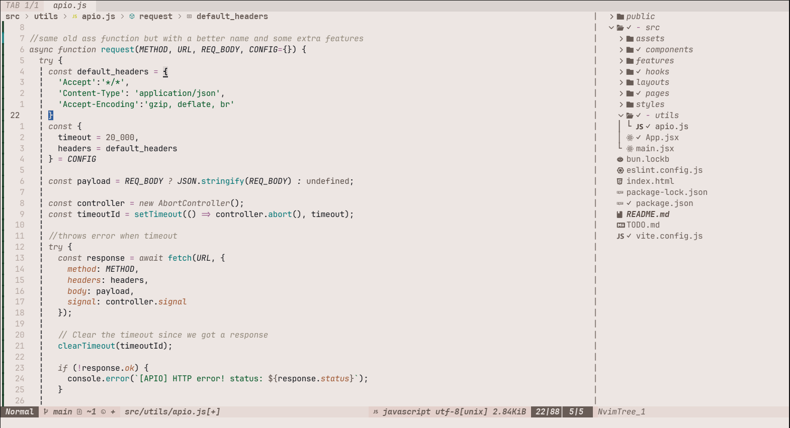

# Neovim Dotfiles
This is the (neovim) <strong>configuration files</strong> of an ordinary guy with a decent written README.md file to catch the attention.

## How many plugins? 
* <strong>20</strong> plugins managed with Lazy.nvim

 

